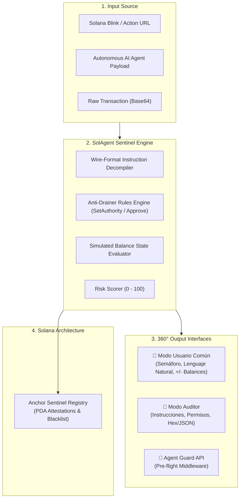

# 🛡️ SolAgent Sentinel

> **Autonomous AI Agent & Blinks Security Runtime Protocol for Solana**  
> Built for the **Colosseum Hackathon — Crypto World's Fair (Fall 2026)**

[](https://solagent-sentinel.vercel.app)
[](https://explorer.solana.com/?cluster=devnet)
[](https://colosseum.com)
[](https://nextjs.org)
[](https://www.anchor-lang.com/)
[](https://opensource.org/licenses/MIT)

> 🚀 **Live Production URL**: [https://solagent-sentinel.vercel.app](https://solagent-sentinel.vercel.app)  
> 🔗 **GitHub Repository**: [https://github.com/camesenin/solagent-sentinel](https://github.com/camesenin/solagent-sentinel)

---

## 🌐 The Problem: Autonomous Agents & Blinks Attack Surface

As **AI Agents** (via Solana Agent Kit, Eliza, LangChain) and **Solana Actions & Blinks** gain explosive adoption, they introduce the most dangerous attack vector in Web3:
1. **Rogue AI Delegations**: If an autonomous trading agent consumes a poisoned prompt or untrusted state, it can blindly sign malicious drainer instructions.
2. **Hidden CPI Drainers**: Ordinary users click an innocent Blink button (*"Claim Free Airdrop"*), while an obfuscated Cross-Program Invocation triggers `SetAuthority` or unlimited `ApproveChecked`, granting attackers permanent ownership of their token accounts.
3. **Cryptic Wallet Warnings**: Standard wallets display unreadable hexadecimal parameters (`Program: TokenkegQfe... Instruction 6`), forcing users to sign in the dark.

---

## 💡 The Solution: SolAgent Sentinel

**SolAgent Sentinel** is an open-source, deterministic runtime security shield and attestation protocol that:
* **Deconstructs Transaction Wire Buffers**: Intercepts instructions before signing to detect `SetAuthority` hijacking, unlimited allowances, and domain spoofing directly from serialized payload opcodes.
* **Provides a 360° Dual Perspective**:
  * **Modo Usuario Común**: Human-readable translation with a traffic-light security badge (🟢 Safe / 🟡 Warning / 🔴 Blocked) and visual balance simulation.
  * **Modo Auditor / Ingeniero**: Deep instruction hierarchy, raw accounts, writable/signer privilege maps, and Anchor IDL signatures.
* **On-Chain Attestation Registry**: An Anchor smart contract architecture designed for Solana (Devnet/Mainnet) to record security audit hashes and blacklist malicious threat signatures via Program Derived Addresses (PDAs).

---

## 🏗️ System Architecture



---

## 🚀 Quick Start

### Prerequisites
* Node.js >= 18.x
* Rust & Cargo (for Anchor smart contract)
* Solana CLI (optional, for devnet deployment)

### 1. Installation
```bash
git clone https://github.com/camesenin/solagent-sentinel.git
cd solagent-sentinel
npm install
```

### 2. Run the Interactive Web Inspector
```bash
npm run dev
```
Open [http://localhost:3000](http://localhost:3000) to view the live dashboard, test case simulator, and dual-perspective inspector.

### 3. Production Build
```bash
npm run build
npm run start
```

---

## 📦 Repository Structure

```
solagent-sentinel/
├── src/
│   ├── app/                    # Next.js 14 App Router (Pages & Metadata)
│   ├── components/             # Dual-perspective UI components
│   │   ├── SecurityShieldBadge.tsx  # Color-coded traffic light shield
│   │   ├── UserViewCard.tsx         # Plain-language explanation for everyday users
│   │   ├── AuditorViewCard.tsx      # Deep AST & instruction inspector for auditors
│   │   ├── BalanceSimulationWidget.tsx # Live visual incoming/outgoing delta
│   │   ├── LiveInspector.tsx        # Interactive scanner for Blinks & Payloads
│   │   └── AttackSimulator.tsx      # Step-by-step AI Agent firewall simulation
│   └── lib/
│       └── sentinel-core/      # Core deterministic cryptographic engine
│           ├── types.ts             # Security audit report interfaces
│           ├── drainerRules.ts      # SetAuthority and CPI drainer detection
│           ├── instructionParser.ts # Transaction AST deconstruction
│           ├── riskScorer.ts        # Multi-factor score calculator (0-100)
│           ├── humanTranslator.ts   # Plain language narrative generator
│           └── mockTransactions.ts  # Authentic battle-tested test scenarios
└── anchor/
    ├── Anchor.toml             # Anchor configuration (Devnet)
    └── programs/
        └── sentinel_registry/  # Smart contract in Rust
            └── src/lib.rs      # Global registry & attestation recorder
```

## 🧪 Automated Security & Audit Suite (19/19 Passing)

Reproduce all deterministic heuristic and cybersecurity penetration tests locally:

```bash
# 1. Run Functional E2E Scenario Suite (Jupiter swap, Drainers, Token-2022)
node sentinel_audit_suite.js

# 2. Run Dedicated Anti-Exploit Suite (SSRF Firewall, DoS payload limits, Math guards)
node sentinel_security_vulnerability_audit.js

# 3. Run Micro-Benchmark Suite (<0.05ms deterministic instruction evaluation)
node autonomous_agent_integration_benchmark.js
```

See [BENCHMARK.md](./BENCHMARK.md) for detailed performance methodology, hardware specifications, and reproducible stress metrics.

---

## 🤖 SentinelGuard SDK for AI Agents (ElizaOS & Solana Agent Kit)

Integrate SolAgent Sentinel into any autonomous AI agent before broadcasting transactions:

```typescript
import { SentinelGuard } from '@/lib/sdk/sentinelGuard';

const guard = new SentinelGuard({
  rpcUrl: 'https://api.devnet.solana.com',
  policy: {
    autoAbortCritical: true, // Block malicious drainers in <35ms
    maxAllowedRiskScore: 60,
  }
});

// Middleware interceptor before agent signing
const audit = await guard.verifyTransaction(serializedAgentTx);

if (!audit.verdict.isApproved) {
  console.error(`🛑 Transaction Aborted: ${audit.verdict.actionNotice}`);
  throw new Error(`Sentinel Security Firewall: ${audit.humanSummary.actionHeadline}`);
}

// Proceed safely with wallet signing
await agentWallet.signAndSendTransaction(tx);
```

---

## 🏆 Colosseum Hackathon Details

* **Hackathon**: Cypherpunk / Crypto World's Fair (Fall 2026)
* **Organized by**: Colosseum & Solana Foundation
* **Track**: AI Agents & Infrastructure / Blinks
* **Lead Builder**: Carlos Mesen ([@camesenin](https://github.com/camesenin))
* **Production Deployment ($0)**: [https://solagent-sentinel.vercel.app](https://solagent-sentinel.vercel.app)
* **Pitch Video (1080p MP4)**: Available in `docs/solagent_sentinel_pitch.mp4`

---

## 📄 License
MIT License. Open source and freely extensible by the Solana community.
