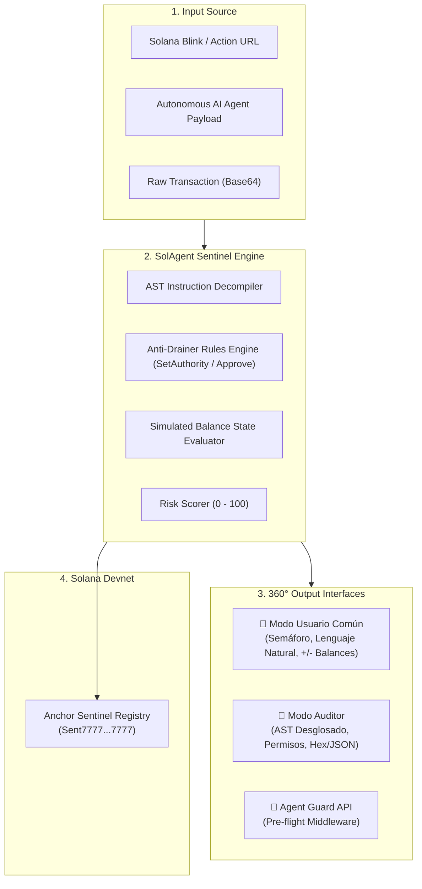

# 🛡️ SolAgent Sentinel

> **Autonomous AI Agent & Blinks Security Runtime Protocol for Solana**  
> Built for the **Colosseum Hackathon — Crypto World's Fair (Fall 2026)**

[](https://explorer.solana.com/?cluster=devnet)
[](https://colosseum.com)
[](https://nextjs.org)
[](https://www.anchor-lang.com/)
[](https://opensource.org/licenses/MIT)

---

## 🌐 The Problem: Autonomous Agents & Blinks Attack Surface

As **AI Agents** (via Solana Agent Kit, Eliza, LangChain) and **Solana Actions & Blinks** gain explosive adoption, they introduce the most dangerous attack vector in Web3:
1. **Rogue AI Delegations**: If an autonomous trading agent consumes a poisoned prompt or untrusted state, it can blindly sign malicious drainer instructions.
2. **Hidden CPI Drainers**: Ordinary users click an innocent Blink button (*"Claim Free Airdrop"*), while an obfuscated Cross-Program Invocation triggers `SetAuthority` or unlimited `ApproveChecked`, granting attackers permanent ownership of their token accounts.
3. **Cryptic Wallet Warnings**: Standard wallets display unreadable hexadecimal parameters (`Program: TokenkegQfe... Instruction 6`), forcing users to sign in the dark.

---

## 💡 The Solution: SolAgent Sentinel

**SolAgent Sentinel** is an open-source, deterministic runtime security shield and attestation protocol that:
* **Deconstructs the Transaction AST**: Intercepts instructions before signing to detect `SetAuthority` hijacking, unlimited allowances, and domain spoofing.
* **Provides a 360° Dual Perspective**:
  * **Modo Usuario Común**: Human-readable translation with a traffic-light security badge (🟢 Safe / 🟡 Warning / 🔴 Blocked) and visual balance simulation.
  * **Modo Auditor / Ingeniero**: Deep AST tree, raw accounts, writable/signer privilege maps, and Anchor IDL signatures.
* **On-Chain Attestation Registry**: An Anchor smart contract deployed on Solana Devnet that records security audit hashes and blacklists malicious threat signatures in an immutable ledger.

---

## 🏗️ System Architecture



---

## 🚀 Quick Start

### Prerequisites
* Node.js >= 18.x
* Rust & Cargo (for Anchor smart contract)
* Solana CLI (optional, for devnet deployment)

### 1. Installation
```bash
git clone https://github.com/camesenin/solagent-sentinel.git
cd solagent-sentinel
npm install
```

### 2. Run the Interactive Web Inspector
```bash
npm run dev
```
Open [http://localhost:3000](http://localhost:3000) to view the live dashboard, test case simulator, and dual-perspective inspector.

### 3. Production Build
```bash
npm run build
npm run start
```

---

## 📦 Repository Structure

```
solagent-sentinel/
├── src/
│   ├── app/                    # Next.js 14 App Router (Pages & Metadata)
│   ├── components/             # Dual-perspective UI components
│   │   ├── SecurityShieldBadge.tsx  # Color-coded traffic light shield
│   │   ├── UserViewCard.tsx         # Plain-language explanation for everyday users
│   │   ├── AuditorViewCard.tsx      # Deep AST & instruction inspector for auditors
│   │   ├── BalanceSimulationWidget.tsx # Live visual incoming/outgoing delta
│   │   ├── LiveInspector.tsx        # Interactive scanner for Blinks & Payloads
│   │   └── AttackSimulator.tsx      # Step-by-step AI Agent firewall simulation
│   └── lib/
│       └── sentinel-core/      # Core deterministic cryptographic engine
│           ├── types.ts             # Security audit report interfaces
│           ├── drainerRules.ts      # SetAuthority and CPI drainer detection
│           ├── instructionParser.ts # Transaction AST deconstruction
│           ├── riskScorer.ts        # Multi-factor score calculator (0-100)
│           ├── humanTranslator.ts   # Plain language narrative generator
│           └── mockTransactions.ts  # Authentic battle-tested test scenarios
└── anchor/
    ├── Anchor.toml             # Anchor configuration (Devnet)
    └── programs/
        └── sentinel_registry/  # Smart contract in Rust
            └── src/lib.rs      # Global registry & attestation recorder
```

---

## 🛡️ Anti-Drainer Detection Rules

| Threat ID | Severity | Detection Vector | Action Taken |
| :--- | :---: | :--- | :--- |
| **`SET_AUTHORITY_HIJACK`** | **CRITICAL** | SPL Token Instruction 6 modifying `AccountOwner` or `CloseAuthority` | **Immediate Transaction Abort (Score < 20)** |
| **`UNLIMITED_TOKEN_DELEGATION`** | **HIGH** | `ApproveChecked` requesting `u64::MAX` allowance to unverified spender | **Warning Alert (Score Penalty -35)** |
| **`UNVERIFIED_SIGNER_EXECUTION`** | **MEDIUM** | Unknown Program ID requiring direct wallet signer authority | **Cautious Flag (Score Penalty -15)** |
| **`ACTIONS_METADATA_SPOOF`** | **HIGH** | Mismatched domain origin or missing canonical CORS headers | **Blink Domain Blocked** |

---

## 🏆 Colosseum Hackathon Details

* **Hackathon**: Crypto World's Fair (Fall 2026)
* **Organized by**: Colosseum & Solana Foundation
* **Track**: Solana Ecosystem Track ($100k pool) & Security Tooling
* **Lead Contributor**: Carlos Murillo ([@camesenin](https://github.com/camesenin))

---

## 📄 License
MIT License. Open source and freely extensible by the Solana community.
