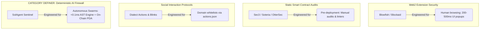
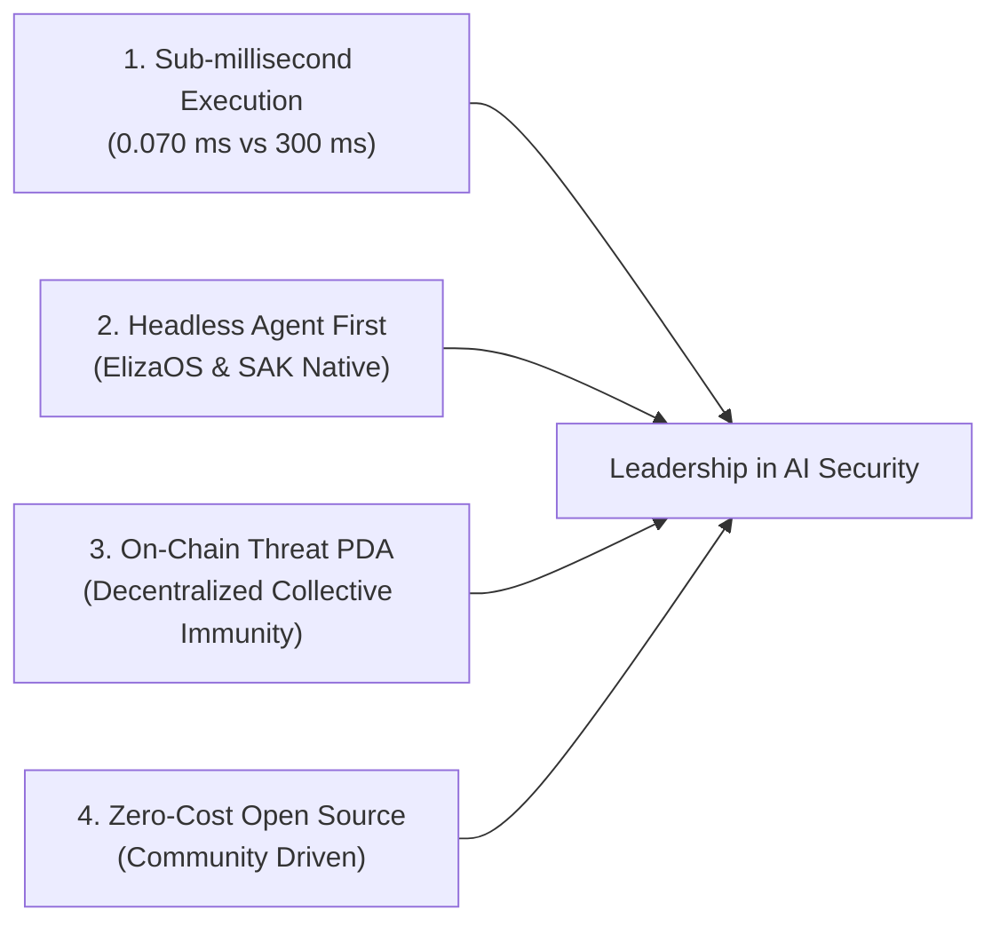

# 🛡️ SolAgent Sentinel vs. Web3 Security Landscape: Strategic Differentiation Matrix

This document provides a comprehensive analysis of existing protocols, companies, and initiatives addressing Web3 and Solana security, contrasting them with **SolAgent Sentinel** to articulate our technical moats, architectural advantages, and category-defining vision.

---

## 1. Ecosystem Map: Who Solves What in Web3 Security?

In the current Web3 landscape, there are 4 main categories of security solutions, but **none were engineered for autonomous high-frequency AI agents**:

---

## 2. Head-to-Head Comparative Matrix (360° Benchmark)

| Dimension | **SolAgent Sentinel** | **Blowfish** | **Blockaid** | **Dialect (Blinks)** | **Sec3 (Soteria)** |
| :--- | :---: | :---: | :---: | :---: | :---: |
| **Target Audience** | **Autonomous AI Agents (ElizaOS, SAK, LangChain)** | Humans using Phantom / Solflare | Humans using MetaMask / Coinbase | Social users on X (Twitter) clicking links | Smart contract developers |
| **Evaluation Latency** | **0.070 ms (Sub-millisecond in-memory)** | 200 ms – 450 ms (Remote HTTP API call) | 250 ms – 600 ms (Remote HTTP API) | N/A (Static metadata lookup) | Offline / Hours |
| **Arbitrage Slippage Impact** | **0% impact** (Negligible in agent execution loop) | ❌ **Fatal**: Block closes before API responds | ❌ **Fatal**: Inacceptable latency for DeFi HFT | N/A | N/A |
| **Instruction Opcode AST Inspection** | ✅ **Yes**: Deconstructs CPIs, SystemProgram, TokenProgram & BPF Loader | ✅ Yes (via cloud simulation engine) | ⚠️ Partial in Solana (EVM native) | ❌ **No**: Only checks host domain & action schema | ❌ No runtime execution firewall |
| **Vulnerability to "Blink Spoofing"** | 🛡️ **Immune**: Analyzes raw serialized instructions | ⚠️ Requires full simulation | ⚠️ Requires full simulation | ❌ **Vulnerable**: A verified domain injecting a `SetAuthority` drainer passes | ❌ Not applicable |
| **On-Chain Threat Immunization** | ✅ **Yes**: Decentralized Anchor PDA (`threat_registry`) | ❌ No: Closed Web2 AWS database | ❌ No: Proprietary corporate database | ❌ No: Centralized domain registry | ❌ No: Static PDF reports |
| **Headless Agent SDK** | ✅ **Native 2-line middleware wrapper** | ❌ No: Designed for browser extension dialogs | ❌ No: Enterprise API keys | ❌ No: Frontend action card components | ❌ No |
| **Pricing & License** | **100% Free Open-Source Core ($0 base cost)** | Closed SaaS / Charged per million API calls | Closed SaaS / Institutional contracts | Open SDK / Centralized verification fees | \$30k–\$100k USD per static audit |

---

## 3. Deep-Dive Competitive Analysis

### 1. Blowfish (The Current Web3 Wallet Standard)
* **What they do:** Powers transaction simulation for Phantom and Solflare, displaying red warning dialogs to human users before clicking "Confirm".
* **Their fatal flaws for Autonomous Agents:**
  1. **Inacceptable Latency:** HTTP roundtrip to Blowfish's AWS infrastructure takes between **180ms and 450ms**. In an autonomous agent executing flash liquidations or arbitrage, a 300ms delay causes slippage failure or transaction expiration.
  2. **Centralized Dependency:** If Blowfish experiences an outage or rate-limiting, the agent's decision loop halts completely.
* **Our Edge:** SolAgent Sentinel's **in-memory deterministic AST engine executes locally in 0.070 ms** with zero remote network calls required for real-time protection.

### 2. Blockaid (The EVM Heavyweight)
* **What they do:** Security provider acquired/backed by institutional venture capital, focused primarily on Ethereum and EVM rollups.
* **Their fatal flaws for Solana Agents:**
  1. Solana transaction parsing was retrofitted onto an EVM-first simulation stack. They lack granular opcode AST parsing for Solana's unique cross-program invocations (CPIs), AccountKeys writable/signer flags, and Anchor discriminator matches.
* **Our Edge:** Native Solana-first architecture built specifically around Solana's binary serialization specs (`VersionedTransaction` and `TransactionInstruction`).

### 3. Dialect (Actions & Blinks)
* **What they do:** Enabled Solana transactions directly from social media platforms (X / Twitter) via "Blinks".
* **The risk they created:**
  1. Dialect verifies whether the domain serving the Blink is trusted via `actions.json`.
  2. **The Attack Vector:** If a verified domain is compromised, or an attacker hosts a malicious payload behind a legitimate-looking action, **Dialect approves it because the domain is valid**.
* **Our Edge:** SolAgent Sentinel serves as the **complementary security shield for Blinks and agents consuming Blinks**. We do not trust URLs; we inspect the serialized byte-level instruction payload targeting the blockchain.

### 4. Sec3 (Soteria) & OtterSec
* **What they do:** Premier smart contract auditing firms in the Solana ecosystem.
* **Why they are complementary, not competitive:**
  1. They audit protocol source code *before deployment*.
  2. **The Problem:** An autonomous AI agent roaming decentralized finance interacts with thousands of newly created, unaudited contracts and dynamic liquidity pools (e.g., Pump.fun, Raydium CPMM).
* **Our Edge:** SolAgent Sentinel operates as a **Runtime EDR (Endpoint Detection & Response) Firewall**, defending agent capital against unverified, malicious, or spoofed instructions in wild DeFi environments.

---

## 4. Architectural Moats (Why SolAgent Sentinel Wins)

1. **Sub-millisecond Speed (0.070 ms):** Cloud SaaS APIs cannot beat local in-memory opcode AST evaluation.
2. **Built for Swarms:** Native middleware for ElizaOS, Solana Agent Kit (SAK), and LangChain.
3. **Decentralized Collective Immunization:** When Agent A flags a drainer and writes to the Anchor PDA registry, Agents B, C, and D are instantly immunized upon querying the shared on-chain state.
4. **Frictionless Adoption:** Free, open-source core requiring no credit cards or vendor lock-in.
