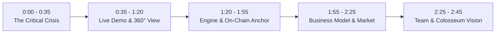

# 🎬 SolAgent Sentinel — Official Colosseum Pitch Video Script

> **Target Duration**: 2 minutes, 40 seconds (< 3 minutes Colosseum hard limit)  
> **Audience**: Colosseum Judges, Solana Foundation, Venture Investors & Accelerator Partners  
> **Key Message**: SolAgent Sentinel is the deterministic runtime security layer protecting Solana users and autonomous AI agents from malicious drainers and rogue delegations.

---

## ⏱️ Video Breakdown

---

### Scene 1: The Hook & The Crisis (0:00 – 0:35)
* **Visual**: Fast-paced montage of X/Twitter posts showing users getting drained by malicious Blinks, followed by terminal logs of an autonomous AI agent signing a rogue transaction.
* **Audio (Spoken)**:
  > *"Solana is leading the world in consumer crypto with Solana Blinks and Autonomous AI Agents. But with this explosion comes a systemic vulnerability: users and AI agents are blindly signing transactions without knowing what is happening under the hood.*
  > 
  > *A single malicious Blink claiming to offer an 'Airdrop' can inject a hidden `SetAuthority` instruction, transferring permanent ownership of your token accounts to an attacker. Standard wallets just show cryptic hex data. That ends today with **SolAgent Sentinel**."*

---

### Scene 2: Live Demo — Catching a Drainer in Real Time (0:35 – 1:20)
* **Visual**: Screen capture of `localhost:3000` (or live production URL). The presenter clicks on "2. Phishing Airdrop con Drainer Oculto (SetAuthority)".
* **Audio (Spoken)**:
  > *"Here is SolAgent Sentinel in action.  
  > In our live inspector, we test an actual phishing airdrop Blink. Notice how the wallet would normally fail to warn you.  
  > But Sentinel deconstructs the compiled Abstract Syntax Tree in under 15 milliseconds.  
  > 
  > It immediately flags a **CRITICAL BLOCK** with a score of 12 out of 100.  
  > For the everyday user, it translates the exploit into crystal clear human language: 'Blocked: This instruction transfers ownership of your tokens to an untrusted third party.' Plus, our visual balance simulation shows the exact impact: 1,250 USDC would have been drained.  
  > 
  > And for security auditors and engineers, one click switches to **Auditor Mode**, displaying the full decoded CPI tree, account privilege maps, and signature verification."*

---

### Scene 3: The Technical Engine & On-Chain Devnet Registry (1:20 – 1:55)
* **Visual**: Visual diagram transition to Anchor smart contract code (`sentinel_registry/src/lib.rs`) and Solana Explorer on Devnet.
* **Audio (Spoken)**:
  > *"Sentinel is not a superficial chatbot wrapper. Our core engine, `sentinel-core`, is deterministic and cryptographic. It inspects SPL Token instructions, the new Token-2022 extensions, System Program account assignments, and `actions.json` headers.  
  > 
  > Furthermore, every evaluation is anchored to our smart contract on Solana Devnet, creating an immutable, decentralized registry of security attestations and blacklisted threat signatures that any wallet or dApp can query."*

---

### Scene 4: Business Model & Market Opportunity (1:55 – 2:25)
* **Visual**: Slide showing integration diagram with Solana Agent Kit, Eliza, and wallet ecosystem.
* **Audio (Spoken)**:
  > *"Our go-to-market is two-fold:  
  > First, a free, community-powered web inspector and browser extension for retail DeFi traders.  
  > Second, our **Sentinel Guard API**—a B2B pre-flight middleware designed for AI agent frameworks like the Solana Agent Kit and Eliza. Every autonomous trading agent needs a firewall before executing transactions on mainnet. We charge micro-fees per verified batch, building a recurring, high-margin SaaS model."*

---

### Scene 5: Team & The Colosseum Vision (2:25 – 2:45)
* **Visual**: Presenter on camera with GitHub contributor profile displaying merged pull requests across Web3 ecosystems.
* **Audio (Spoken)**:
  > *"I'm Carlos Murillo, a senior systems engineer with over 24 merged pull requests across open-source blockchain infrastructure in 2026 alone.  
  > 
  > We built SolAgent Sentinel because autonomous agents are the future of finance, but they cannot scale without absolute security. With Colosseum's accelerator and seed funding, we will make Sentinel the default security runtime for the entire Solana ecosystem. Thank you."*

---

## 🛠️ Recording Checklist
- [ ] Screen resolution set to 1080p (1920x1080) at 60fps.
- [ ] Browser zoom at 100% or 110% for crisp typography.
- [ ] Devnet explorer link open and loaded in a background tab.
- [ ] Clear microphone audio with noise suppression enabled.
- [ ] Total video runtime strictly between 2:30 and 2:45.
