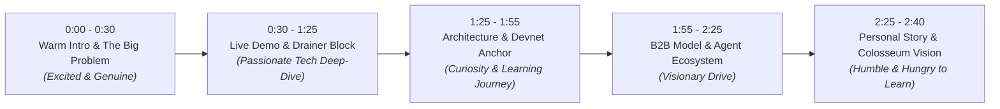

# 🎬 SolAgent Sentinel — Official Colosseum Pitch Video Script (Authentic & Passionate)

> **Duration**: 2 minutes, 40 seconds (< 3 minutes Colosseum hard limit)  
> **Presenter**: Carlos Murillo (@camesenin)  
> **Tone**: High enthusiasm, authentic humility (first-time submission excitement), deep curiosity, and unstoppable desire to learn and build.

---

## ⏱️ Video Structure & Emotional Arc

---

### Scene 1: The Personal Hook & The Solana Crisis (0:00 – 0:30)
* **Visual**: Camera starts on a warm greeting, transitioning quickly into a montage of Solana Blinks and AI Agent terminal logs on `https://solagent-sentinel.vercel.app`.
* **Voiceover**:
  > *"Hi everyone! I'm Carlos Murillo, and to be completely honest, this is my very first time submitting to the Colosseum Hackathon, so I'm a little bit nervous, but I am so genuinely excited to show you what we've built!  
  > 
  > Solana is leading the absolute frontier of crypto with Blinks and Autonomous AI Agents. But as I dove into the ecosystem, I realized a massive blind spot: agents and everyday users are signing transactions completely blind. A single malicious Blink can inject a hidden `SetAuthority` instruction, silently stealing your token accounts forever. That curiosity to solve this critical danger led to **SolAgent Sentinel**."*

---

### Scene 2: Live Demo — Real-Time Drainer Interception (0:30 – 1:25)
* **Visual**: Live screen recording of `https://solagent-sentinel.vercel.app`. The cursor switches from Spanish to English seamlessly, clicks Scenario 2 ("Phishing Airdrop with Hidden Drainer"), reveals the red shield and score 12, then toggles into "Auditor Mode" to inspect the AST.
* **Voiceover**:
  > *"Let me show you how it works in our live production app right now.  
  > 
  > Here, we simulate an actual phishing airdrop Blink. Usually, your wallet just shows meaningless hexadecimal strings. But look at what Sentinel does in under 15 milliseconds!  
  > 
  > It deconstructs the compiled Abstract Syntax Tree and immediately hits a **CRITICAL BLOCK** with a score of 12 out of 100.  
  > For a normal user, it speaks plain human language: 'Blocked: This transaction tries to take over your account ownership.' It even shows a visual balance card: 1,250 USDC saved!  
  > And because I wanted both everyday users and hardcore developers to love this, one click toggles into **Auditor Mode**, exposing the decoded instruction hierarchy, account privileges, and CPI traces."*

---

### Scene 3: The Engine, Learning Journey & Anchor Smart Contract (1:25 – 1:55)
* **Visual**: Fast transition into the codebase: Anchor program `sentinel_registry/src/lib.rs` and the SSRF firewall.
* **Voiceover**:
  > *"Building this was an incredible learning curve for me. Our engine, `sentinel-core`, is completely deterministic and cryptographic. We inspect SPL Token instructions, the new Token-2022 extensions, and System Program account assignments.  
  > 
  > We even built a dedicated Server-Side Request Forgery firewall to prevent metadata attacks on Blinks!  
  > Furthermore, every evaluation can be anchored to our smart contract on Solana Devnet, creating a decentralized, immutable registry of blacklisted drainer signatures that any app can query."*

---

### Scene 4: B2B Middleware for the AI Agent Economy (1:55 – 2:25)
* **Visual**: Diagram showing `SentinelGuard` middleware intercepting transactions for Solana Agent Kit and ElizaOS.
* **Voiceover**:
  > *"Where this gets really thrilling is the autonomous agent economy. As frameworks like Solana Agent Kit and Eliza take off, autonomous bots are going to execute millions of on-chain transactions without human supervision. They need a pre-flight firewall!  
  > 
  > That's why we packaged our SDK so any agent builder can add SentinelGuard middleware in just two lines of code. It checks the AST, tests RPC simulation, and aborts before the bot signs a poisoned transaction. It's a scalable B2B SaaS model that grows with Solana's agent volume."*

---

### Scene 5: Why Colosseum & Closing (2:25 – 2:40)
* **Visual**: GitHub profile displaying 24 merged blockchain pull requests in 2026, transitioning to the live Vercel badge and a warm final smile.
* **Voiceover**:
  > *"I have been contributing heavily to open source this year with over 24 merged pull requests across blockchain infrastructure, but winning a spot in Colosseum's Accelerator would be life-changing.  
  > 
  > I have a burning curiosity to learn from the best mentors in the ecosystem, refine Sentinel, and make Solana the safest home for autonomous finance. Thank you so much for your time and consideration!"*
